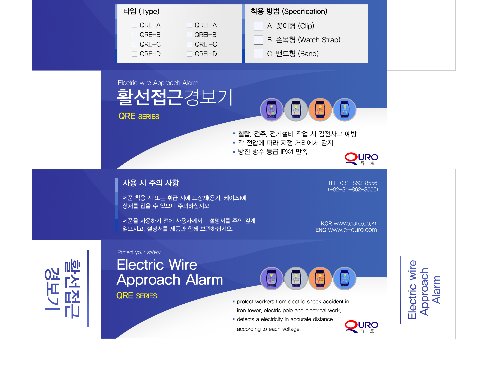

# Live-Wire-Detector ⚡
 >  **고전압 환경에서 위험시 작업자에게 알람을 울리는 안전 장치**


<br />

## 담당
- **```제품 개발 총괄```**
- 각 동작 전압 별 **```14개의 버전 제작```**
- 필요 센서 및 부품 구축
- 제품 패키징 및 홍보 팜플렛 제작


<br />
<br />

## 홍보 디자인




- **```팜플렛, 배너, 패키징 디자인 제작```**


<br />
<br />

## 프로토타입 제작 과정


- 프로토타입 제작 당시 **```다양한 센서를 테스트```** 하여 최적의 제품 개발

<br />
<br />

## 성과
- 한국전력공사, 삼성엔지니어링 등 다양한 기업에 납품함으로써 **```연매출 2억 원 달성```**